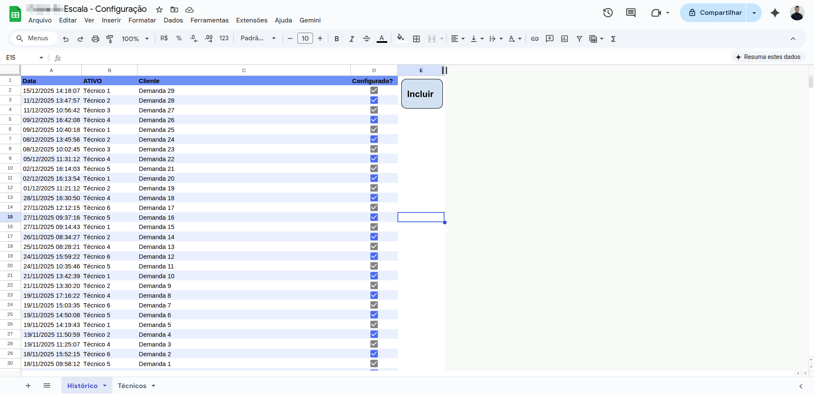

## 💻 Projeto

Transformei uma planilha com Google Apps Script em um sistema Web dinamico.
Utilização: O analista de projetos do departamento irá utilizá-la para designar o técnico que será responsável por configurar a demanda.

## 🧪 Tecnologias

Esse projeto foi desenvolvido com as seguintes tecnologias:

- [HTML](https://developer.mozilla.org/en-US/docs/Web/HTML)
- [JavaScript](https://developer.mozilla.org/en-US/docs/Web/JavaScript)
- [CSS](https://developer.mozilla.org/en-US/docs/Web/CSS)
- [Firebase](https://firebase.google.com/)
- [GitHub Pages](https://docs.github.com/pt/pages)

## 🖱️ Layout

Você pode visualizar o projeto hospedado no link abaixo:

- [Projeto hospedado](https://brunofvilela.github.io/EscalaConfig/)

## 🖱️ Antes e depois:

